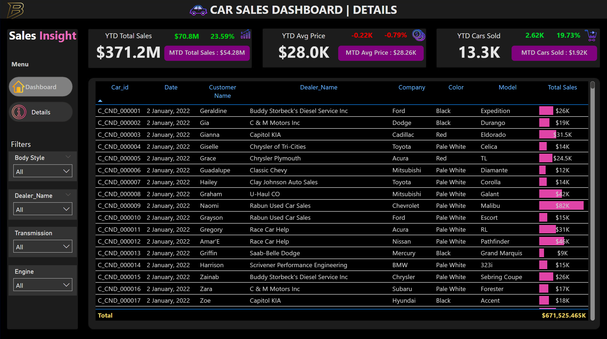

# 🚗 Car Sales Dashboard – Power BI

This project showcases a fully interactive Car Sales Dashboard built using Power BI. It visualizes key performance indicators (KPIs), trends, and detailed sales information to help a car dealership monitor and optimize sales performance. The dashboard provides both high-level insights and granular transaction-level details.

---

## ❗ Problem Statement

To enhance visibility into our car dealership’s sales performance, we needed a **dynamic, interactive Car Sales Dashboard** built in **Power BI**. The goal was to centralize and visualize our sales KPIs in real time, enabling data-driven decision-making and identification of key business trends.

### 🔍 Objectives:

* Track **Year-to-Date (YTD)** and **Month-to-Date (MTD)** performance across sales, pricing, and volume.
* Compare current performance to **Previous Year-to-Date (PTYD)** values and monitor **Year-over-Year (YOY)** growth.
* Enable executives and analysts to gain insights into:

  * Sales trends by **week**
  * Sales breakdown by **body style** and **color**
  * Sales distribution across **dealer regions**
  * Company-level performance trends
  * Detailed transactional data for every car sale

### 📈 Dashboard Requirements:

* **Sales KPIs:** YTD, MTD, YOY growth and PTYD comparisons for Total Sales, Average Price, and Cars Sold.
* **Visuals Needed:**

  * **Weekly Sales Trend** (Line Chart)
  * **Sales by Body Style & Color** (Pie Charts)
  * **Cars Sold by Region** (Map)
  * **Company-wise Sales Summary** (Tabular Grid)
  * **Detailed Sales Table** with car-specific information

This solution empowers our team to monitor real-time performance, identify opportunities, and respond quickly to changing market conditions through intuitive, visual analysis.

---

## 📊 Key Insights

* **Total YTD Sales:** \$371.2M
* **MTD Sales:** \$54.28M
* **YTD Avg Price:** \$28.0K
* **Total Cars Sold (YTD):** 13.3K
* **Top Dealer Regions:** Austin, Scottsdale, Janesville, Greenville
* **Top Companies by Sales:** Chevrolet, Dodge, Ford

## 💡 Dashboard Features

* Real-time and historical KPI tracking
* Sales analysis by body style, color, company, and geography
* Interactive filters for Body Style, Dealer, Transmission, and Engine
* Weekly and monthly sales trends
* Detailed drill-down into every car transaction

## 🛠 Tools Used

* **Power BI** (Data modeling, DAX, dashboard design)
* **Data Preparation** using Power Query
* **Excel** for early data validation

## 📁 Files Included

* `Car_Sales_Dashboard.pbix` – Power BI dashboard file
* `Dashboard.png` – Main overview dashboard
* `Dashboard_Details.png` – Drill-down sales details table
* `Problem_Statement.docx` – Business background and requirements

## 🖼 Preview

### Main Dashboard View

### Detailed Sales Table View

## 📬 Contact

For questions or collaboration:
**Bilal**

* 📧 Email: [bilalbenassila@gmail.com](mailto:bilalbenassila@gmail.com)
* 🔗 LinkedIn: [My LinkedIn](https://www.linkedin.com/in/bilalbenasila)
